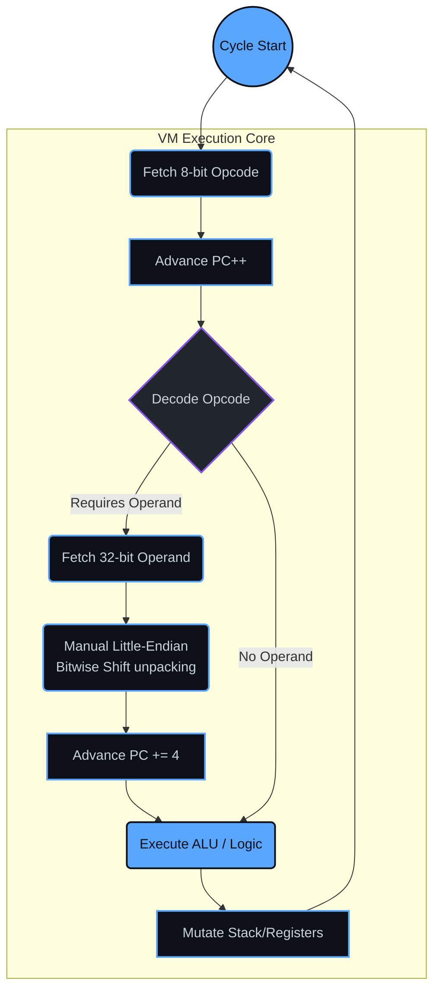
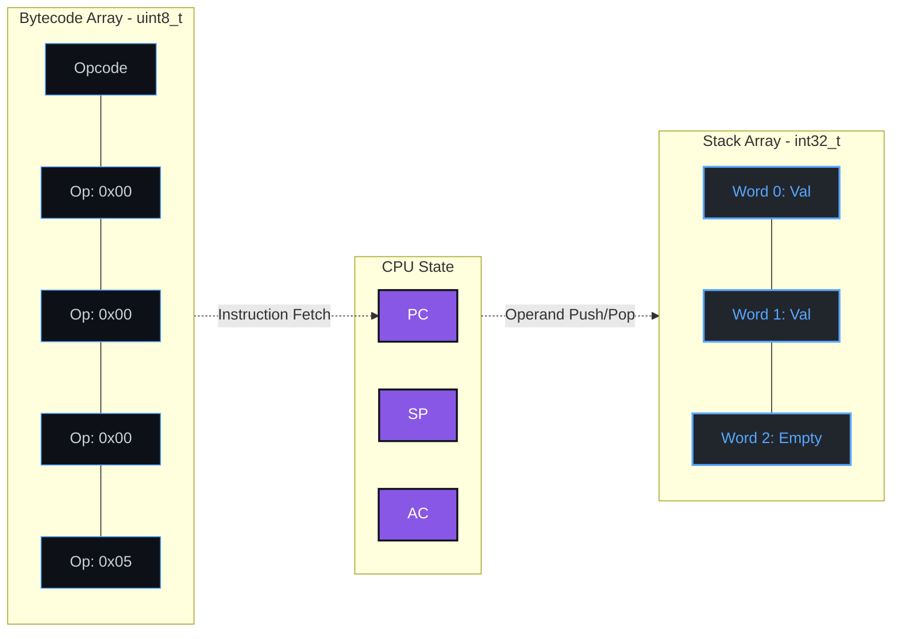

<div align="center">
  
# ProtoPTX

**A Custom Stack-Based Virtual Machine & Bytecode Assembler**

[](https://isocpp.org/)
[]()
[]()
[]()

*ProtoPTX is a meticulously engineered Systems Architecture project, built entirely from scratch in modern C++. Designed to demonstrate a rigorous understanding of low-level systems programming, it features a custom 8-bit Instruction Set Architecture (ISA), manual bitwise memory deserialization, and a robust Fetch-Decode-Execute pipeline.*

---
</div>

## 🏗️ Architecture Overview

ProtoPTX models a virtual hardware environment with explicit constraints. It operates as a stack-machine but incorporates an Accumulator (`AC`) register to solve state-persistence limitations inherent to pure stack systems. 

### The Fetch-Decode-Execute Pipeline



### Memory Layout & Registers

The system enforces strict memory bounds:
* **Program Memory:** `4KB` of `uint8_t` bytecode.
* **Stack Memory:** `256` depth of `int32_t` words.



---

## ⚙️ Systems Engineering Focus (The "Why")

ProtoPTX was built to demonstrate proficiency in compiler design and hardware-level memory management concepts:

1. **Bypassing Abstractions (`memcpy` avoidance):** 
   A core engineering requirement of ProtoPTX is that the Virtual Machine must strictly reconstruct 32-bit integers dynamically at runtime from the 8-bit program memory array. Instead of using standard library pointer casting or `std::memcpy`, the VM relies entirely on **manual Little-Endian bitwise left-shifts (`<<`) and bitwise OR (`|`) operations**. This guarantees explicit, transparent memory mapping and proves an understanding of raw byte manipulation.

2. **Solving the Stack-Machine State Limitation:**
   Pure stack machines struggle with loops that require both an accumulator (sum) and a persistent counter, as operations like `ADD` natively consume their operands. To resolve this Turing-incomplete limitation, ProtoPTX introduces state persistence through an **Accumulator Register (`AC`)**, alongside `LOAD_AC` and `STORE_AC` instructions.

---

## 📜 Instruction Set Architecture (ISA)

ProtoPTX implements an 8-bit operation code mapping.

| Opcode | Hex | Mnemonic | Operands | Description |
|:---|:---:|:---|:---|:---|
| `01` | `0x01` | **PUSH** | `<int32_t>` | Pushes an immediate 32-bit value onto the stack. |
| `02` | `0x02` | **POP** | *none* | Removes the top value from the stack. |
| `03` | `0x03` | **ADD** | *none* | Pops two values, computes the sum, and pushes the result. |
| `04` | `0x04` | **SUB** | *none* | Pops two values, subtracts the top from the second-top, pushes result. |
| `05` | `0x05` | **JMP** | `<int32_t>` | Unconditional jump. Sets the Program Counter (`PC`) to target byte address. |
| `06` | `0x06` | **JMP_IF_ZERO** | `<int32_t>` | Pops the top value; if zero, jumps to the target byte address. |
| `07` | `0x07` | **PRINT** | *none* | Pops the top value and prints it to standard output. |
| `08` | `0x08` | **DUP** | *none* | Duplicates the top value on the stack. |
| `09` | `0x09` | **LOAD_AC** | *none* | Pushes the value of the Accumulator (`AC`) onto the stack. |
| `10` | `0x0A` | **STORE_AC** | *none* | Pops the top value and stores it in the Accumulator (`AC`). |
| `255`| `0xFF` | **HALT** | *none* | Halts the Virtual Machine execution loop. |

---

## 💻 Assembly Example

The Assembler converts human-readable strings directly into packed bytecode. Below is a sophisticated Loop Accumulation test calculating the sum of 5 down to 1. 

```cpp
std::string test2_source = 
    "PUSH 0 \n"         // Byte 0: Push 0
    "STORE_AC \n"       // Byte 5: Init Accumulator (Sum) to 0
    "PUSH 5 \n"         // Byte 6: Push initial counter (5)
                        
                        // LOOP_START (Address: 11)
    "DUP \n"            // Byte 11: Duplicate counter for the zero-check
    "JMP_IF_ZERO 32 \n" // Byte 12: If counter == 0, break loop to END_LOOP (32)
    
                        // --- Add counter to Sum ---
    "DUP \n"            // Byte 17: Duplicate counter again to add it to sum
    "LOAD_AC \n"        // Byte 18: Push current sum from AC
    "ADD \n"            // Byte 19: Add sum + counter
    "STORE_AC \n"       // Byte 20: Store new sum back to AC
    
                        // --- Decrement Counter ---
    "PUSH 1 \n"         // Byte 21: Push 1
    "SUB \n"            // Byte 26: counter - 1
    
    "JMP 11 \n"         // Byte 27: Jump back to LOOP_START (11)
    
                        // END_LOOP (Address: 32)
    "POP \n"            // Byte 32: Clean up the 0 counter from stack
    "LOAD_AC \n"        // Byte 33: Load final Sum from Accumulator
    "PRINT \n"          // Byte 34: Print result (Output: 15)
    "HALT \n";          // Byte 35: Stop execution
```

---

## 🚀 Quick Start

Built entirely using `g++` standard libraries. No external dependencies, no CMake required.

**1. Clone & Compile**
```bash
g++ -std=c++17 main.cpp Assembler.cpp VM.cpp -o ProtoPTX.exe
```

**2. Run the Virtual Machine**
```bash
.\ProtoPTX.exe
```

---

<div align="center">
  Built with ❤️ by Sujal Agrawal
</div>
